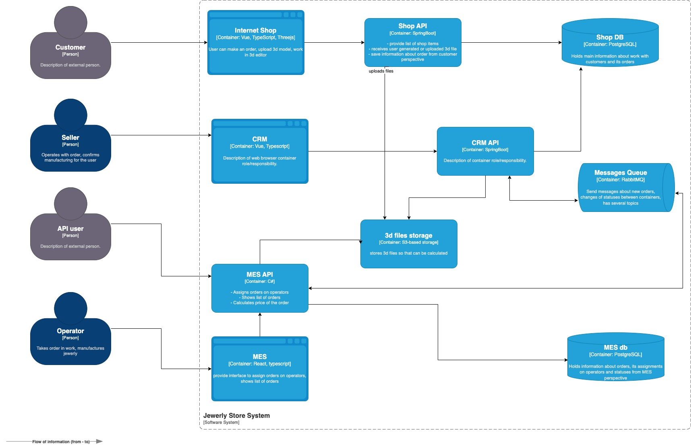
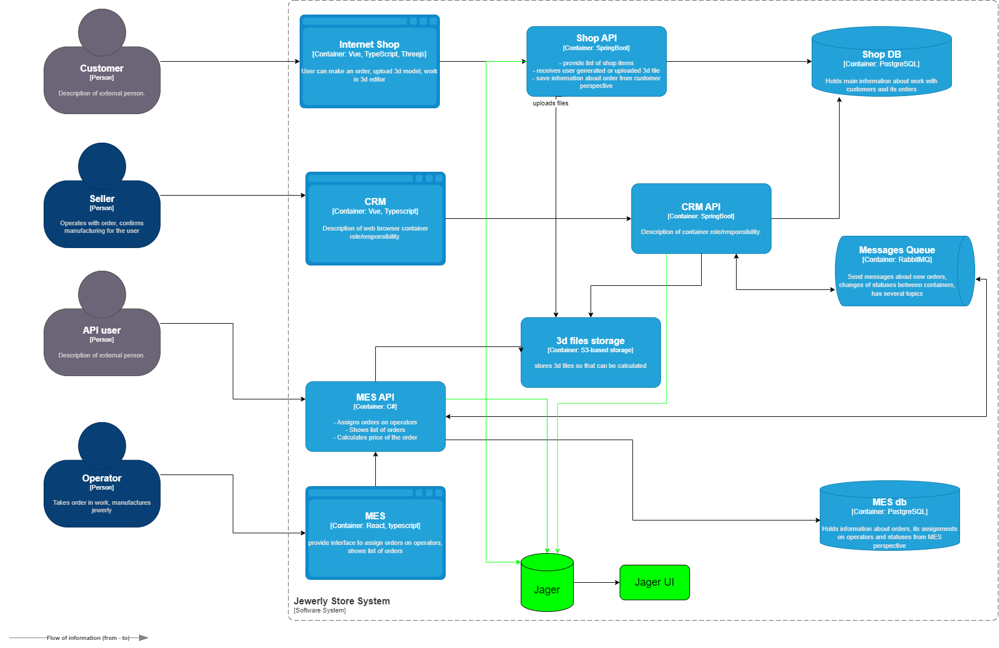

# Задание 3. Архитектурное решение по трейсингу

Команда видит, что заказы часто находятся в непонятном состоянии или зависают на каком-то сервисе внутри IT-ландшафта. Проблемы с заказами могут появляться и вовсе только потому, что сообщения теряются.
Вам необходимо внедрить инструмент, с помощью которого команда сможет увидеть, что происходило с заказом и где он находится сейчас.

### Текущая схема системы

Исходя из текущей схемы мы видим, что заказ проходит через все основные сервисы:
- онлайн-магазин
- CRM
- MES
- S3 storage
- Message Queue

Каждый сервис представлен только одним инстансом, поэтому узким местом может быть любой из узлов системы. 

Возможные причины:
- Загрузка невалидной 3d модели.
- Расчет стоимости 3d модели в сервисе MES может занять больше времени или процесс может зависнуть. Необходимо установить максимальное время для расчета стоимости, а также отменить заказ в случае ошибок расчета.
- Ошибки при отправке сообщений через MessageQueue.
- Ручная обработка заказов операторами.

### Жизненный цикл заказа

- INITIATED [онлайн-магазин] — пользователь завёл новый заказ или положил товары в пустую корзину.
- FILE_UPLOADED [онлайн-магазин] — пользователь загрузил файл с 3D-моделью или создал его с помощью конструктора.
- SUBMITTED [онлайн-магазин] — пользователь нажал на кнопку «Сделать заказ».
- PRICE_CALCULATED [MES] — система посчитала стоимость заказа.
- MANUFACTURING_APPROVED [CRM] — заказ подтверждён, его можно отдавать в производство.
- MANUFACTURING_STARTED [MES] — оператор взял заказ в работу.
- MANUFACTURING_COMPLETED [MES] — оператор выполнил заказ.
- PACKAGING [MES] — оператор начал упаковывать заказ.
- SHIPPED [MES] — заказ отправлен покупателю.
- CLOSED [CRM] — заказ завершён. Он закрывается после получения сообщения от транспортной компании или вручную.

## Мотивация

- Эффективно диагностировать проблемы с заказами клиентов.
- Сократить до минимума количество "потерянных" заказов.
- Быстрая диагностика позволит улучшить клиентский опыт.
- Трейсинг вместе с мониторингом позволит определить узкие места системы и позволит обосновать масштабирование критических узлов.

## Предлагаемое решение

Воспользуемся наиболее популярной платформой реализации трейсинга - OpenTelemetry. А для визуализации трейсинга используем Jaeger, т.к. он поддерживает OpenTelemetry.
В этой системе собираются и обрабатываются все трейсы и метрики, которые существуют внутри контекста. Контексты можно передавать от приложения к приложению.

## Компромиссы

- Так как система MES была сторонним софтом, потребуется больше усилий команды для успешного внедрения трейсинга в этот сервис. К тому же, если это устаревший код, то настроить клиент Jager будет невозможно, понадобится обновлять библиотеки MES. В таком случае необходимо оценить целесообразность трейсинга.
- Онлайн-магазин это монолитное приложение, поэтому внутри этого приложения легче использовать логирование, т.к. все компоненты находятся внутри одного процесса.

## Безопасность

- Трейсинг должен использоваться только для диагностики проблем с заказами, а не аналитики данных. Поэтому необходимо работать только с идентификаторами запросов (trace_id, span_id) и не добавлять лишние метаданные запросов (номер заказа, ФИО клиента, сумма заказа и т.д.).
- Если у компании есть VPN, то доступ к Jager UI должен быть только в пределах локальной сети компании.
- Если VPN нет, то необходимо настроить политику доступа по ролям. Например, только пользователи с ролью Support, могут смотреть логи трейсинга. Обычно это дежурные инженеры, которые меняются каждый спринт или тим-лид с продакт-менеджером.
- Настроить отправку заявки в поддержку, обязательными полями указать уникальный идентификатор запроса.
