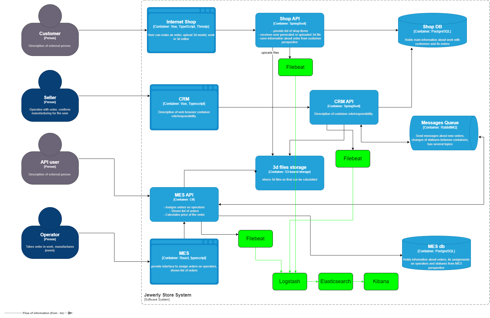

# Задание 4. Архитектурное решение по логированию

## Планирование логирования

INFO:
- Создание/изменение заказа: время запроса, id заказа, id клиента, source (онлайн-магазин, внешний клиент, MES, CRM).
- Расчет стоимости заказа в MES: время запроса, id заказа, id клиента, source(онлайн-магазин, внешний клиент, MES, CRM), время расчета.
- Отправка сообщения в MesageQueue: время запроса, id заказа, id сообщения, source (онлайн-магазин, MES, CRM).
- Действия клиента в онлайн-магазине - добавление товара в корзину, просмотр страниц товаров: время запроса, id клиента, страница, действие (view, add-item, remove-item, etc.).
- Действия продавца в CRM - изменение товара, изменение профиля, etc.: время запроса, id продавца, действие.

ERROR:
- Все критические ошибки: создание запроса, расчет стоимости, отправка сообщения, действия клиента, продавца и т.д.

DEBUG:
- Детализированные логи: инициализация сервисов, экземпляров классов, время работы важных функций. Этот класс логов должен быть доступен только в Dev среде или в release, prod среде с помощью специального флага.

## Мотивация

- Наблюдаемость. Логирование необходимо для лучшей прозрачности системы. Для любого заказа можно восстановить всю цепочку действий.
- Диагностика. Почти для любой ошибки, мы можем найти сервис/функцию, которая вернула ошибку.
- Поддержка. Почти для любой заявки от клиента, мы можем найти "потерянный" заказ и дать оперативный ответ.
- Бизнес-логика. Логи ошибок позволят улучшить текущие сервисы и бизнес-логику.

### Компромисс
Если логирование нельзя внедрить сразу во всей системе, то стоит опираться на предварительных результатах трейсинга и реализовать в том сервисе, который чаще других вызывает проблемы.

Например, если по результатам трейсинга замечено, что многие заказы "теряются" на стороне MES, то и логирование нужно внедрить в первую очередь в MES.

## Предлагаемое решение

Можно использовать логирование на уровне сервисов и использовать стандартный стек ELK.
- Filebeat - агрегирует данные из сервиса и посылает их в LogStash.
- Logstash - собирает данные из всех сервисов и отправляет в ElasticSearch.
- Elasticsearch - сохраняет данные в NoSQL базе и строит индексы.
- Kibana - используется для визуализации логов.

### Политики безопасности и сроки хранения

- Индексы можно настроить под каждый сервис в системе: shop API, CRM API, MES API.
- Сроки хранения зависят от возможностей и потребностей бизнеса. Для онлайн магазина оптимально будет хранить логи за последние 30 дней. Если заказы закрываются быстрее, то можно сократить срок до 2-3 недель.
- Главное правило безопасности и конфиденциальности состоит в минимизации использования пользовательских данных. Для целей диагностики и мониторинга нам достаточно использовать идентификатор заказа и клиента, а также время и источник запроса. Любые метаданные, связанные с деталями запроса или клиента, мы можем достать из БД напрямую.

## Анализ логов

Обычно алертинг настраивается через системы мониторинга, например Grafana Alerting. Логи используются для получения дополнительных деталей, например ID клиента в случае DDoS атаки. Далее клиент блокируется в системе.
Для онлайн-магазина дополнительная настройка аномалий и анализ логов через системы ELK считаю излишней.

