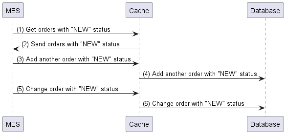

# Задание 5. Архитектурное решение по кешированию

## Мотивация

- Пользователи жалуются на низкую скорость работы со страницами сайта. Эту проблему можно решить масштабированием инстансов и/или добавлением кеширования часто используемых данных.
- Также будет полезным добавить кеширование для данных в онлайн-магазине: это товары и данные пользователя.
- Операторы жалуются на низкую скорость работы сервиса MES при работе с заказами клиентов.
- Необходимо снизить нагрузку на сервер MES, MES DB.

## Предлагаемое решение

Будем использовать серверное кеширование, т.к. основные проблемы сайт испытывает с данными из БД: заказы.

Онлайн-магазин:
- Кешируем данные о товарах. Товары в БД обновляются не так часто, поэтому можно использовать самую простую стратегию - Cache-Aside. При добавлении новых товаров, 1й запрос к ним будет направлен к БД и обновит данные в кеше.
- Эту же стратегию можно использовать для данных пользователя в личном кабинете.
- Если данные товара или пользователя были изменены, то инвалидируем только эти записи в кеше по ключу: id товара/пользователя.

CRM, MES
- Обе системы изменяют данные заказа, т.е. используются частые операции чтения и записи. Но в то же время нам важно улучшить производительность, поэтому воспользуемся методом Write-Behind. Он позволит нам не ждать обновления БД, а сразу отдать результат из кеша.

### Инвалидация кеша

Здесь можно инвалидировать кеш, если у заказа меняется статус. То есть при каждом изменении статуса, мы сначала обновляем кеш, а после в асинхронном режиме обновляем БД.

Если на дашборде MES мы будем показывать только новые заказы, то и в кеше хранить нужно только заказы со статусом NEW (готовые к работе). В таком случае, кеш нужно инвалидировать, когда появляется очередной заказ со статусом NEW, или заказ со статусом NEW переходит в работу или завершается.
